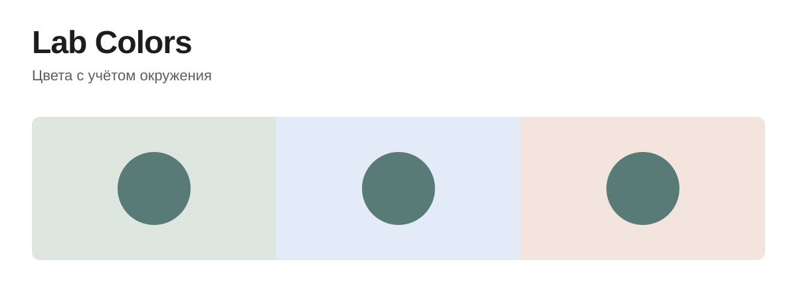

# Lab Colors



[Первый пример](packages/colors/README.md#первый-маршрут) · [Публичный API](packages/colors/README.md#контракт) · [Исходники ядра](crates)

Цвет в интерфейсе существует рядом с другими цветами: на поверхности, поверх
изображения, в нескольких полупрозрачных слоях. Lab Colors позволяет описать
эти связи и ограничения, а затем вычислять цветовые значения при изменении
окружения.

Вы задаёте исходные цвета и связи. Ядро проверяет граф, принимает наблюдения
среды и возвращает вычисленные значения. Имена токенов и смысл состояний
остаются у вашего приложения.

*На обложке все круги одного цвета. Это авторская композиция, а не вывод движка.*

## Начать

```sh
npm install @labpics/colors
```

[Первый рабочий пример](packages/colors/README.md#первый-маршрут) показывает
путь от объявления графа до чтения результата. Там же описаны освобождение
ресурсов и границы публичного контракта.

## Как это устроено

- **Описание.** `ProgramWireBuilderV1` собирает граф в канонические wire-байты.
- **Вычисление.** `compileProgramWire` создаёт runtime; `updateObserved`
  передаёт новое наблюдение среды.
- **Результат.** Snapshot содержит выходные значения. Отказ не публикует
  частично обновлённое состояние.

Применение цветов к DOM и CSS принадлежит приложению.
Подробности — в [контракте пакета](packages/colors/README.md#контракт).

## Работа с исходниками

```sh
cargo test --workspace
npm test
```

Зависимости ядра можно посмотреть командой:

```sh
cargo tree -p labcolors-core --edges=no-dev
```

Состояние проверок — в [GitHub Actions](https://github.com/Labpics-Team/lab-colors/actions).

## Лицензия

MIT
