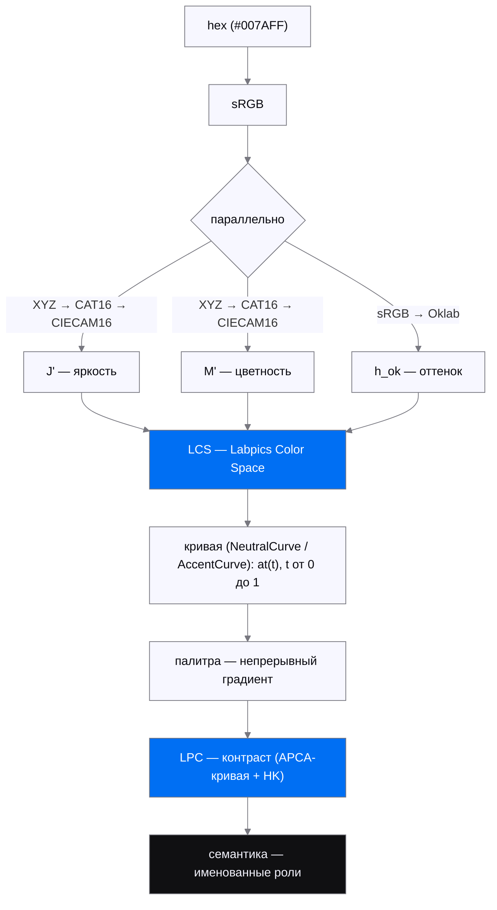
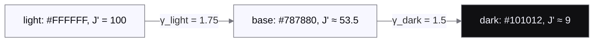
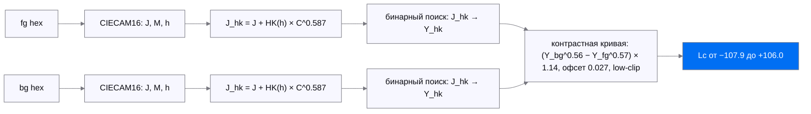
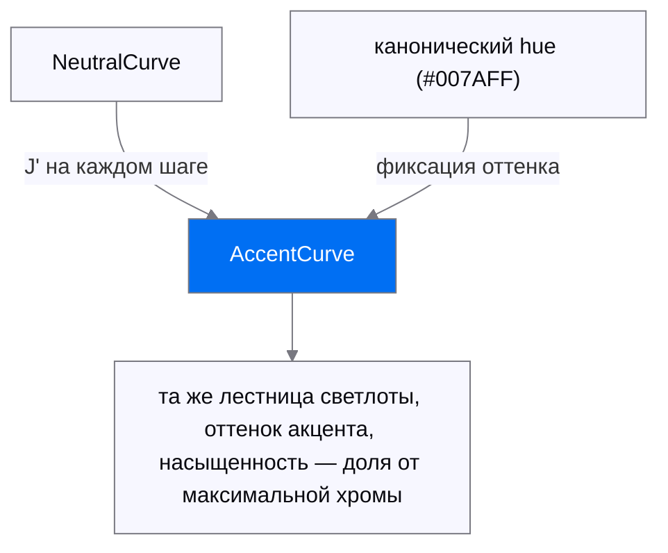
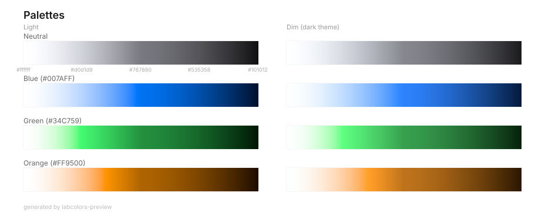

# Lab Colors

Компилятор цветовых систем. Как компилятор превращает исходник в детерминированный бинарь, Lab Colors превращает бренд и законы цвета в детерминированную цветовую систему — один и тот же вход всегда даёт байт-идентичный выход.

**Вход:** бренд и клиентские anchors · физика (перцептуальное пространство LCS, гамут sRGB, контраст) · психофизика (эффект Гельмгольца-Кольрауша, перцептуальная светлота, адаптация зрения к окружению). Сентименты проверяются по фактической попарной геометрии anchors, без универсальных hue-зон.

**Выход:** цветовая система целиком — таблица именованных ролей, темы, контраст с юридическим полом WCAG 2.1 AA.

Ядро — Rust без внешних зависимостей (`crates/labcolors-core`). В браузер оно приходит WASM-пакетом [@labpics/colors](packages/colors/README.md); нативные биндинги (WASM, Swift) обязаны воспроизводить платформо-нейтральные тест-векторы `labcolors-conformance`.

## Проблема

Обычные шкалы (HSL lightness, Oklab L) не учитывают, как видит глаз:

- серый `#808080` не выглядит «половиной» между чёрным и белым — он кажется светлее 50 %;
- синий и жёлтый одинаковой яркости воспринимаются по-разному (эффект Гельмгольца-Кольрауша);
- один и тот же цвет в тёмной теме выглядит иначе (адаптация зрения к окружению).

Lab Colors решает это через собственное перцептуальное цветовое пространство — LCS.

## Пайплайн



Схемы стилизованы фиксированными заливками палитры проекта с обводкой `#787880`: тема GitHub на них не влияет, каждый узел отделён от любого фона рамкой (проверено рендером на `#FFFFFF` и `#0D1117`).

## LCS — Labpics Color Space

LCS — перцептуальное цветовое пространство поверх CIECAM16 (модели цветового зрения CIE) с двумя отличиями.

**1. Яркость и цветность — из CAM16-UCS, не из «сырого» CIECAM16.**

CIECAM16 даёт J и M, но они не перцептуально однородны. CAM16-UCS применяет рескейлинг:

```text
J' = 1.7 × J / (1 + 0.007 × J)         — сжимает верхний диапазон
M' = ln(1 + 0.0228 × M) / 0.0228       — логарифмическая компрессия
```

Результат: `J' = 50` воспринимается как «половина яркости» между чёрным и белым; у «сырого» `J = 50` это не так. Формулы — CAM16-UCS (Li et al. 2017, DOI [10.1002/col.22131](https://doi.org/10.1002/col.22131)); в коде — `spaces/cam16.rs` (`ucs_j` / `ucs_m`), применяет их `lcs.rs`.

**2. Оттенок — из Oklab, не из CAM16.**

CAM16-hue (`h_cam`) хранится для обратной конвертации в XYZ (математика требует его), но интерполяция между цветами идёт по Oklab-hue (`h_ok`): он перцептуально ровнее, меньше «завалов» в синей и жёлтой зонах. Oklab — Björn Ottosson, [«A perceptual color space for image processing»](https://bottosson.github.io/posts/oklab/) (2020); реализация — `spaces/oklab.rs`.

**Итоговый `LcsColor`:**

```text
struct LcsColor {
    jp: f64,     // J' — перцептуальная яркость (CAM16-UCS)
    h_ok: f64,   // оттенок (Oklab) — для интерполяции
    s: f64,      // репараметризация цветности: s = M' / (J' + 1)
    h_cam: f64,  // оттенок (CAM16, приватное поле) — для обратной конвертации в hex
}
```

`s` — внутренняя репараметризация колоритности `M'`, а **не** корелят насыщенности CAM16. `+ 1` — регуляризатор против деления на ноль при `J' → 0`; репараметризация без потерь: `M' = s × (J' + 1)` восстанавливается точно.

### ViewingConditions — адаптация к окружению

Один и тот же стимул в светлом и тёмном окружении даёт разные J'. Пример ниже — компилируемый doctest, числа проверяет CI:

```rust
use labcolors_core::{LcsColor, ViewingConditions};

let srgb = ViewingConditions::srgb();         // светлая тема: c = 0.69
let dim = ViewingConditions::dim_surround();  // тёмная тема: c = 0.59

let grey_light = LcsColor::from_hex_with_vc("#787880", &srgb).unwrap();
let grey_dim = LcsColor::from_hex_with_vc("#787880", &dim).unwrap();

// mid-grey в тёмном окружении воспринимается светлее:
assert!((grey_light.jp - 53.55).abs() < 0.05); // J' ≈ 53.5
assert!((grey_dim.jp - 59.23).abs() < 0.05);   // J' ≈ 59.2
```

Каждая кривая хранит VC, которым была создана. Создать кривую с dim VC, а конвертировать в hex через srgb VC нельзя — будет дрифт (закреплено тестом `wrong_vc_roundtrip_drifts` в `lcs.rs`).

### Кривая — NeutralCurve

Три якоря (светлый, базовый, тёмный) соединяются непрерывной кривой в пространстве J'. Это не набор шагов, а функция `at(t)` при `t` от 0 до 1; палитра — непрерывный градиент, `sample_hex(13)` просто выбирает из него 13 точек.



**Степенная интерполяция.** J' идёт не линейно, а через `u^γ` — больше шагов в середине шкалы (где глаз различает лучше) и меньше на краях.

**Hue-purity.** У почти-серого якоря `atan2(b, a)` возвращает случайный угол — оттенок из шума. Вместо жёсткого порога — плавный вес чистоты оттенка:

```text
purity = (mp / mp_ref)^0.6
```

`purity → 0` (серый): оттенок принудительно к базовому; `purity → 1` (насыщенный): оттенок якоря остаётся как есть. Экспонента `0.6` и множитель опорной хромы `1.5` — инженерная калибровка формы (см. `neutral.rs`), не данные Эбни: коррекция Эбни вынесена в отдельную задачу.

**Chroma envelope.** C1-непрерывная (гладкая вместе с производной) огибающая хромы через все три якоря: ранний хроматический пик у светлого конца, плато у базы, спад к тёмному якорю. Якоря воспроизводятся точно, разрывов нет — непрерывность закреплена тестами.

### Контраст — LPC (Labpics Perceptual Contrast)

LPC = опубликованная контрастная кривая APCA + коррекция Гельмгольца-Кольрауша. Кривая не меняется — меняется luminance, который в неё подаётся.



1. Оба цвета переводятся в CIECAM16 (J, M, h).
2. HK-коррекция: `J_hk = J + HK_coeff(h) × C^0.587`, где `C = M / F_L^0.25` (Hellwig 2022) — насыщенные цвета воспринимаются ярче.
3. Бинарный поиск находит Y (luminance), дающий этот J_hk в стандартных условиях.
4. Контрастная кривая считает Lc по скорректированным Y_hk; экспоненты «тёмное-на-светлом» — 0.56/0.57, «светлое-на-тёмном» — 0.65/0.62.

**Почему не чистый APCA:** APCA работает на luminance напрямую — синий и серый с похожим Y получили бы одинаковый контраст на белом, хотя синий воспринимается ярче (HK-эффект). LPC это учитывает: `#444444` на белом — Lc 87.6, `#0000FF` — Lc 68.7.

**Почему не WCAG:** WCAG-ratio — симметричное отношение относительных яркостей, без HK и без направления «текст/фон». LPC направленный и перцептуальный; WCAG остаётся юридическим полом (см. ниже).

### Конформанс: WCAG2-пол + LPC-цель

LPC — перцептивная цель; юридический минимум — WCAG 2.1 AA (через [EN 301 549](https://www.etsi.org/deliver/etsi_en/301500_301599/301549/03.02.01_60/en_301549v030201p.pdf) его требует European Accessibility Act): 4.5:1 для текста, 3:1 для UI-элементов. Решатель держит обе планки: целится в LPC-таргет, затем проверяет WCAG-ratio выходного цвета; если закон строже перцепции — цвет досдвигается до пола, а результат помечается флагом `floor_override`. Оба числа — Lc и WCAG-ratio — отчитываются раздельно и никогда не смешиваются. Декоративные контракты (`Contract::range`) юридического пола не получают: к сепараторам и заливкам требования читаемости не применяются.

## Семантика

`solve()` отвечает «какой цвет даёт *этот* контраст на *этом* фоне». Семантический слой (`semantic.rs`) поднимается на ступень выше и отвечает на продуктовый вопрос: «дай весь набор именованных цветов, который нужен UI на этом фоне».

Ядро **агностично** (ADR-0001): таксономию ролей поставляет потребитель через [`ThemeConfig`], который компилируется в `NamedRoleTable`; `resolve_named_set(bg, &table, vc)` решает весь набор одним проходом со строковыми ключами. Встроенной дизайн-системы нет — любая компания подключает свою. Сериализацию в CSS custom properties делает рантайм; здесь только структурированная карта «имя роли → `Resolved`».

```rust
use labcolors_core::{
    resolve_named_set, BgInput, Brand, NeutralAnchors, NeutralConfig, NeutralTint,
    RoleRecipe, SentimentsConfig, ThemeConfig, ThemesConfig, VcPreset, ViewingConditions,
};
use labcolors_core::ladder::ThemeAnchors;
use labcolors_core::solve::Floor;

let anchors = |l: &str, d: &str| ThemeAnchors {
    light: l.to_string(), dark: d.to_string(),
    light_ic: l.to_string(), dark_ic: d.to_string(),
};
// Минимальный конфиг потребителя: бренд, нейтраль и одна текстовая роль.
// `ThemeConfig` помечен `#[non_exhaustive]` — снаружи собирается через `new`,
// не struct-литералом (пресет при желании задаётся после, полем `preset`).
let config = ThemeConfig::new(
    Brand { anchors: anchors("#007AFF", "#4DA3FF") },
    NeutralConfig {
        anchors: NeutralAnchors {
            light: "#FFFFFF".into(), mid: "#787880".into(), dark: "#101012".into(),
        },
        tint: NeutralTint { ratio: 0.10, target_mp: 6.1, hue_stiffness: 9.0, hue_override_deg: None },
        edge: None, inverted: None,
    },
    vec![],
    SentimentsConfig { categories: vec![] },
    ThemesConfig { entries: vec![("light".into(), VcPreset::Srgb)] },
    vec![(
        "label-primary".into(),
        RoleRecipe::TextAnchor { fraction: 0.97335917, floor: Floor::AaText, hue: None },
    )],
    vec![],
);

let table = config.compile_named_role_table().unwrap();
let bg = BgInput::solid("#FFFFFF").unwrap();
let set = resolve_named_set(&bg, &table, &ViewingConditions::srgb());
// label-primary на белом → холодный почти-чёрный семейства #101012, а не стерильный серый.
assert!(set.iter().any(|(name, r)| name == "label-primary" && r.solved().is_some()));
```

Четыре закона решателя:

**Полярность — из фона, и в первую очередь по WCAG-достижимости.** Роль хранит только *модуль* контраста; знак (тёмное-на-светлом или светлое-на-тёмном) выбирается по фону. Сначала — по достижимости юридического пола 4.5:1: это свойство одного фона, не зависящее от viewing conditions, поэтому полярность стабильна между темами. При ничьей — обе полярности легальны на узкой полосе `Y ∈ [0.175, 0.1833]` (около `#767676`; туда же попадает хроматика той же яркости вроде `#0078D4`) — выбирается светлое-на-тёмном: на всей полосе перцептивный слой предпочитает белый с запасом. Прежнее правило «большая WCAG-маржа» отдавало Fluent-синий `#0078D4` чёрному вопреки конвенции — исправлено. Светло-серые фоны (`#808080`, `#999999`) не отдают «все текстовые роли недостижимы»: чёрный текст на них проходит AA с запасом, а WCAG-перелом лежит около `#747474`.

**Санити вместо арифметики: принцип якоря.** Контрасты текста — не фиксированные дельты, а *доли от максимального контраста, который фон вообще может дать*. Primary просит ~97 % максимума, поэтому он почти чёрный на белом и почти белый на чёрном — на *любом* фоне. Доли (`0.97335917 / 0.64359014 / 0.47572199 / 0.29335999`) откалиброваны по референсным Figma-якорям, перенесённым в Ys-мерило читаемости (генезис-замеры Y_hk: 102.6 / 66.5 / 48.9 / 29.3; tertiary — побайтовая инверсия генезис-якоря 48.9 → `#9C9C9C`), и помечены «калибруется» до визуальной приёмки. Поскольку все текстовые роли — доли одного per-фон максимума, иерархия `primary > secondary > tertiary > quaternary` строгая там, где фон физически это позволяет, и симметрична в обеих полярностях. Где WCAG-пол всё же поднимает одну сторону — это видно по `floor_override`, не тихий дрейф.

**Компрессия иерархии флагуется, не молчит.** На околопороговом сером (вроде `#747474`), где читаемое окно фона уже шага иерархии, юридический пол может прижать соседние роли в одну точку. Вместо тихого схлопывания двух ролей в один hex — честная деградация: младшую роль сдвигают на минимально различимый квант ниже старшей, пока она держит свой пол, и помечают флагом `Resolved::compressed`. Потребитель видит флаг, а не обнаруживает два одинаковых цвета.

**Токен нуля.** «Пусто» — это значение, а не отсутствие записи: роль-ноль решается в явный `Resolved::None` (честный ноль), а не в пропуск ключа.

### Референс-потребитель: labui

Ядро агностично, но у него есть замороженный референс-конфиг — паспорт labui: `crates/labcolors-wasm/tests/data/labui.config.json`, он же байт-идентичный тест-оракул. Это один конкретный потребитель; любой другой бренд подключает свою таблицу тем же путём.

Паспорт: **100 ролей + 7 алиасов**, четыре темы (`light`/`dark` и повышенно-контрастные `light-ic`/`dark-ic`), бренд `#007AFF`/`#4A8FFF` (+ ic-пара), нейтраль `#FFFFFF`/`#787880`/`#101012` с холодным подтоном (`hue_override_deg: 286`, `target_mp: 6.1`), палитра из 10 именованных семейств (`red` … `pink` — те же, что `Accent::ALL` в ядре).

Роли по рецептам (`RoleRecipe` конфига):

| Рецепт | `kind` в JSON | Ролей | Примеры |
|---|---|---|---|
| `TextAnchor` | `text-anchor` | 25 | `label-primary` … `label-quaternary`, цветные `label-brand-*` |
| `Ladder` | `ladder` | 59 | ступени тинтов бренда/палитры/сентиментов/нейтрали: большинство `fill-*` и `border-*`, `label-accent`, `label-danger` |
| `PairFill` | `pair-fill` | 7 | `badge-fill-brand` … `badge-fill-static-light` — поверхность пары «заливка × лейбл» |
| `Glow` | `glow` | 4 | `fx-glow-brand` / `-danger` / `-warning` / `-neutral` |
| `Zero` | `zero` | 3 | `border-none`, `fill-none`, `none` — явный `Resolved::None` |
| `DjAnchor` | `dj-anchor` | 2 | `bg-tone-2` (dJ' 2.03/5.78), `bg-tone-3` (dJ' 2.03/9.6) — пер-темные dJ'-якоря |

Текстовые якоря labui:

| Роль | Доля от максимума | Пол WCAG |
|---|---|---|
| `label-primary` | 0.97335917 | AA текст 4.5:1 |
| `label-secondary` | 0.64359014 | AA текст 4.5:1 |
| `label-tertiary` | 0.47572199 | AA UI 3:1 |
| `label-quaternary` | 0.29335999 | нет (WCAG исключает inactive-элементы) |

7 алиасов — вторые имена ролей: `icon → label-tertiary`, `border-ghost → border-none`, `border-neutral → border-base`, `fill-neutral-tinted → fill-primary`, `fill-accent → badge-fill-brand`, `fill-danger → badge-fill-danger`, `fx-skeleton-base → fill-quaternary`. (`icon` и `border-ghost` в ранних версиях были самостоятельными ролями.)

Словарь рецептов ядра шире паспорта: есть ещё `DecorativeLc` — декоративная величина в Lc, знак от фона; такие контракты держатся выше надёжного пола решателя (`DECORATIVE_FLOOR_MIN` = 7.5 Lc) — и `PairLabel` — лейбл, чей WCAG-пол энфорсится против тинт-поверхности бейджа, а не фона страницы.

Подтон таблицы — `RoleChroma`, выведенный из нейтрали конфига: дефолтный `RoleChroma::Curve` держит тонированный подтон (не чистый серый); альтернативы — `RoleChroma::Neutral` (ахроматика) и `RoleChroma::flat_neutral_tint()` (плоский тинт v1).

### Материал: двухслойный контракт стекла/акрила (`RoleRecipe::Material`, #89)

Материальная поверхность (стекло/акрил) — полупрозрачный тинт `01` над опаковой базой `02`, обе один тон `T` (семейно-оттеночная поверхность на целевом |ΔJ'| тира; `base` крупнее/плотнее, `subtle` тоньше). Рецепт `Material { source, tone_light, tone_dark, floor }` отдаёт пару: тинт `01 = oklch(T / α)` и база `02 = oklch(T)`. Солид-канон `01`-над-`02` байт-точно равен тону (композит `T` над `T` есть `T`), поэтому единственная решаемая величина — **альфа, и она не рукописная**: [`material.rs`](crates/labcolors-core/src/material.rs) выводит минимальную плотность, при которой композит тинта над ХУДШИМ разрешённым фоном (коридор `[чёрный, белый]` — стекло над неизвестным живым фоном) держит пол читаемости коммит-полюса поверхности. Порядок тиров (base плотнее subtle) выводится этой физикой, не подбором; гарантия пересчитываема потребителем из эмитированных `01`/`02` (та же α-граничная математика). Нейтральный материал (`source: neutral`) держит подтон таблицы (286°); семейный (`brand`/`sentiment`/`family`) несёт оттенок якоря — это разблокирует акцент-стекло. Полная физика — whitepaper §3.7.

## AccentCurve

Акцентный цвет (например `#007AFF`) протягивается через нейтральную шкалу:



На каждом шаге J' берётся из нейтральной шкалы; для этой светлоты и канонического hue ищется максимальная хрома, достижимая в гамуте sRGB, и умножается на долю насыщенности исходного цвета от максимума.

## Визуально

Палитры, сгенерированные кривыми: нейтральная шкала в светлом и тёмном окружении и акцентные цвета; каждая полоса — непрерывный градиент `at(t)`:



## API

```rust
use labcolors_core::{ViewingConditions, ColorCurve};
use labcolors_core::neutral::{NeutralCurve, CurveParams};
use labcolors_core::scale::AccentCurve;

// Нейтральная шкала — светлая тема
let light = NeutralCurve::new("#FFFFFF", "#787880", "#101012").unwrap();
// Палитра — непрерывный градиент; at(t) — любая точка от 0.0 до 1.0
let mid = light.at(0.5);
println!("t=0.5  J'={:.1}", mid.jp);

// sample_hex(N) — N точек из непрерывной кривой
let steps: Vec<String> = light.sample_hex(13);
// ["#FFFFFF", "#F8F8FA", "#E7E8EC", ..., "#101012"]

// Нейтральная шкала — тёмная тема
let dim_vc = ViewingConditions::dim_surround();
let dark = NeutralCurve::with_vc(
    "#FFFFFF", "#787880", "#101012",
    &CurveParams::default(), &dim_vc,
).unwrap();

// Акцент
let blue = AccentCurve::new("#007AFF", &light).unwrap();
let blue_steps: Vec<String> = blue.sample_hex(13);

// Контраст между двумя цветами
let lc = labcolors_core::lpc::lpc("#000000", "#ffffff");
// lc ≈ 106.0

// Обобщённо через трейт
fn print_curve(curve: &dyn ColorCurve) {
    for i in 0..=12 {
        let c = curve.at(i as f64 / 12.0);
        println!("t={:.2}  J'={:.1}", i as f64 / 12.0, c.jp);
    }
}
print_curve(&light);
print_curve(&dark);

assert_eq!(steps.len(), 13);
assert_eq!(blue_steps.len(), 13);
assert!(lc > 100.0);
```

## Структура проекта

```text
crates/
├── labcolors-core          — ядро (Rust, без внешних зависимостей)
├── labcolors-wasm          — WASM-биндинги (+ паспорт labui как тест-оракул)
├── labcolors-ffi           — нативный UniFFI-биндинг ядра (Swift, Apple-платформы)
├── labcolors-conformance   — платформо-нейтральные тест-векторы канона: любой биндинг обязан их воспроизвести
└── labcolors-preview       — превью-рендер палитр
packages/
└── colors                  — npm-пакет @labpics/colors поверх WASM
docs/
├── cleanliness-v2.md       — научный контракт чистоты, область применимости и фальсифицируемость
├── whitepaper.md, empirical-inventory.md, decisions/, conformance/, …
└── palette.svg
```

Продакшн-модули ядра (`crates/labcolors-core/src`):

```text
lib.rs            — публичные реэкспорты; README встраивается в crate-доки
lcs.rs            — LcsColor: hex ↔ LCS
neutral.rs        — NeutralCurve: нейтральная шкала
scale.rs          — AccentCurve: акцентная шкала
accent.rs         — палитра акцентов как данные: 10 именованных семейств
curve.rs          — трейт ColorCurve
solve.rs          — обратный решатель: solve(bg, contract) → цвет
lpc.rs            — LPC-контраст (APCA-кривая + HK)
wcag.rs           — WCAG 2.1 relative-luminance ratio (юридический пол)
semantic.rs       — NamedRoleTable, resolve_named_set, Resolved
sentiment.rs      — сентимент-цвета
config.rs, config/ — граница конфига: ThemeConfig → NamedRoleTable
ladder.rs         — лестницы тинтов как данные
pair.rs           — пара «поверхность × лейбл»
glow.rs           — свечения (fx-glow-*)
alpha.rs          — альфа-аналог солида (композит-инверсия)
accent_balance.rs, accent_surface.rs, cleanliness.rs, hash.rs — вспомогательные законы и утилиты
spaces/
├── cam16.rs      — CIECAM16 forward/inverse (+ CAM16-UCS: ucs_j / ucs_m)
├── cat16.rs      — CAT16 cone transform
├── oklab.rs      — Oklab hue
├── oklch.rs      — CSS-эмиссия oklch
├── p3.rs         — Display-P3
├── srgb.rs       — sRGB ↔ XYZ (D65) (+ srgb/ — таблица декода)
└── vc.rs         — ViewingConditions (srgb, dim_surround, ic-варианты)
```

Тест-модули (`golden_tests.rs`, `config/tests.rs`, `*/tests.rs`) под `#[cfg(test)]` в карту не входят.

## Тесты

`cargo test --workspace` гоняет юнит-, мета- и doctest-ы — **включая примеры этого README**: он встроен в доки ядра через `#[doc = include_str!]`, поэтому каждый `rust`-блок здесь компилируется и исполняется в CI, а битая интра-док-ссылка вида [`ThemeConfig`] валит джоб `docs`.

CI на каждом PR — пять джобов на Rust 1.96.0:

- **lint** — `cargo fmt --all --check` и `cargo clippy --workspace --all-targets -- -D warnings`
- **docs** — `RUSTDOCFLAGS="-D warnings" cargo doc --workspace --no-deps`: битые intra-doc-ссылки — ошибка сборки
- **test** — `cargo test --workspace`
- **audit** — `cargo audit --deny warnings` (RustSec: уязвимые или отозванные зависимости блокируют мерж)
- **wasm** — release-сборка `wasm-pack`, затем typecheck + runtime-тесты `@labpics/colors` против собранного `pkg/` в headless-Chrome и замер размера бандла

Что покрыто:

- **lcs** — roundtrip под обеими VC, дрейф при чужой VC
- **neutral** — монотонность J', непрерывность кривой, точность якорей, chroma envelope, hue-дрейф, dim-тема
- **scale** — акцентная кривая: монотонность, попадание в гамут, dim-тема
- **sentiment** — формула неравных радиусов, независимость от порядка, отказ на
  недостижимой паре и финальная проверка всех попарных anchor-дистанций
- **lpc** — полярность контраста, H-K-буст со сверкой против Hellwig 2022
- **golden_tests** — кросс-валидация CIECAM16 против colour-science с задокументированными допусками
- **spaces** (oklab, vc) — Oklab hue и roundtrip, параметры окружения
- **curve** — превью рендерит кривую через её собственную VC

## Зависимости

`labcolors-core` имеет **ноль рантайм-зависимостей** — секция `[dependencies]` в `crates/labcolors-core/Cargo.toml` пуста. Вся математика (Oklab, CIECAM16, CAT16, sRGB, условия просмотра) написана напрямую в исходниках, без внешних крейтов.

Единственные зависимости — dev-only (`pretty_assertions`, `criterion`): они компилируются только под `cargo test` / `cargo bench` и ничего не добавляют в рантайм-сборку, в том числе в WASM-бандл. Проверяется:

```sh
cargo tree -p labcolors-core --edges=no-dev
```

Вывод — один узел `labcolors-core` без потомков.

Свойство важно для встраивания и WASM: цветовая библиотека не тащит `tokio` / `serde` в бандл. При переходе к LCS v1.0 (см. #27) Oklab становится инструментом калибровки, не рантайм-зависимостью, — граница нулевых рантайм-зависимостей сохраняется.

## Что дальше

- **Конфиг-граница (ADR-0001, PR-c)** — ломающая чистка ядра: снос запечённых `RoleTable::default` / `enum Role` / данных `Accent` после зелёного потребительского поезда labui. Ядро `ThemeConfig`, рецепт `Ladder` и WASM-`loadConfig` уже влиты.

## LPC vs APCA

LPC переиспользует опубликованную контрастную кривую (экспоненты, мягкую отсечку чёрного, low-contrast clip и офсеты полярности версии `0.0.98G-4g`), но это **другая метрика**. LPC не является APCA, не APCA-совместима и не комплаентна, не одобрена Myndex Research или Andrew Somers. Copyright (17 U.S.C. § 102(b)) не охраняет формулы и константы — только конкретный код; данная реализация написана независимо. Товарный знак «APCA» в публичном API не используется.

Ключевое отличие — что подаётся в кривую: LPC использует яркость, скорректированную по Гельмгольцу-Кольраушу, APCA — относительную яркость sRGB.

| | LPC | APCA (референс) |
|---|---|---|
| Вход в кривую | `Y_hk` — яркость с H-K-коррекцией через CIECAM16 | `Y_sRGB` — относительная яркость |
| Контрастная кривая | экспоненты 0.56 / 0.57 / 0.62 / 0.65, scale 1.14, clip + офсеты набора `0.0.98G-4g` | те же |
| Ахроматика | совпадает: чёрный-на-белом `106.04` бит-в-бит (запинено тестом); серая ось — в пределах ~1.5 Lc от канона (`#444444` на белом: 87.6) | референс |
| Хроматика | расходится: H-K поднимает воспринимаемую светлоту насыщенных цветов — `#0000FF` на белом даёт Lc 68.7, заметно ниже, чем дал бы серый той же Y_sRGB | без H-K |
| Имя / комплаентность | LPC, не APCA-комплаентна, без бренда | «APCA» — товарный знак Myndex |

**Совпадает на ахроматике.** Чёрный и белый — точные концы шкалы яркости (`Y_hk = 0` и `1`), H-K-слой на них не влияет: чёрный-на-белом воспроизводится бит-в-бит (`106.0407`). Остаточная цветность CAM16 у внутренних серых даёт сдвиг в пределах ~1.5 Lc.

**Отличается на хроматике.** Насыщенные цвета воспринимаются ярче, и LPC поднимает их `Y_hk` — контраст синего с белым падает относительно оценки по «слепой» яркости sRGB; эта разница и есть вклад H-K.
