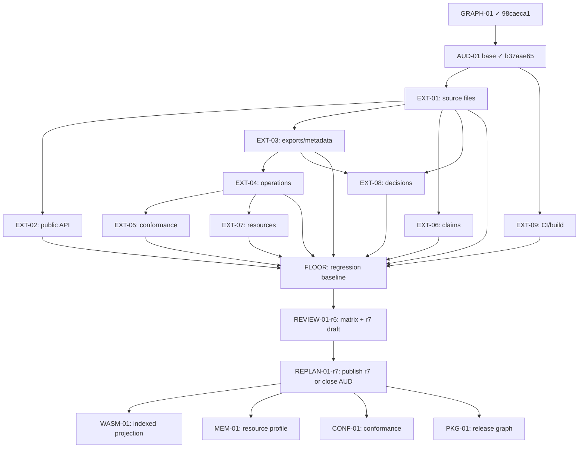

# Lab Colors — r6 (DRAFT)

**Evidence cutoff:** `2026-08-29T00:00:00Z` (agents-config `origin/main` pending REPLAN-01; lab-colors `main` `98caeca1` post GRAPH-01 merge, AUD-01 baseline `b37aae65` ALL_PASS 1287 tests).

## 0. Delta from r5

r6 supersedes r5; r5 remains immutable historical baseline. r5 established GRAPH-01 as the single ready implementation node and bounded-pass AUD-01 as terminal audit artifact. All r5 nodes completed successfully:

| r5 Node | Status | Evidence |
|---|---|---|
| GRAPH-01 | MERGED | `98caeca1` on lab-colors main |
| AUD-01 | COMPLETE | `b37aae65`, 1287 tests ALL_PASS, 3/14 classes covered |
| REVIEW-01 | PASS | Both verdicts (plan-contract + future-axis) PASS |
| REPLAN-01 | PENDING | This draft is the input |

**What changes in r6:**

- AUD-01 extends from bounded 3/14 classes to ≥10/14 classes via 10 new implementation nodes (AUD-01-EXT-01..09 + FLOOR)
- WASM-01 becomes the next implementation node after AUD-01 extension completes
- Total estimated effort ~22h across 3-4 parallelizable fronts
- Acceptance criteria shift from "bounded pass complete" to "≥10/14 classes with finite manifest rows"

**What carries forward unchanged:**

- INV-01 through INV-05 remain valid
- DAG structure preserved; only node statuses and readiness change
- Rollback protocol for GRAPH-01 already merged applies as-is
- MEM-01, CONF-01, PKG-01 remain blocked until AUD-01 extension completes
- cargo-public-api remains optional evaluated tool, not mandatory dependency

## 1. Objective and Acceptance

One objective: extend AUD-01 coverage from 3/14 to ≥10/14 declared artifact classes through finite, reproducible manifest extraction per class, producing a matrix that either closes bounded-pass AUD-01 at ≥10/14 or explicitly names remaining gaps as r7 triggers.

**Acceptance criteria (all must be YES):**

1. `ACTIVE.md` atomically points to r6; r5 unchanged byte-for-byte; `node plans/tools/plan-lint.mjs --base origin/main` and `node plans/tools/plan-status.mjs` exit 0;
2. ≥10 of 14 declared artifact classes have finite manifest rows with observed command/result/disposition/owner/replan-trigger on exact existing SHA (`b37aae65` or later if intervening merges occur);
3. Each of the 10 AUD-01-EXT nodes has merged PR with RED→GREEN proof for its target class extractor plus sabotage controls demonstrating fail-capability;
4. FLOOR node establishes minimum test count baseline (≥1287 + new tests per extension) and CI gate enforcing no regression;
5. Matrix contains zero identifier-without-row and zero row-without-identifier violations; any class without reproducible extractor gets class-level `NotAssessed` row with explicit r7 trigger;
6. WASM-01 is named as next implementation node with explicit GRAPH/MEM predecessor assertions and #415 contract reference, but NOT started;
7. Independent review (plan-contract + future-axis) PASS on final matrix + r7 draft; all findings resolved/re-reviewed;
8. MEM-01, CONF-01, PKG-01 remain blocked; no scope creep into Session #401, resource values #429, or release work.

## 2. Key Decisions

| Decision | Rationale | Rejected Alternative | Why Rejected |
|---|---|---|---|
| Extend AUD-01 rather than start WASM-01 immediately | Future-axis verdict recommends ≥10/14 coverage before next implementation node; 3/14 insufficient for confident WASM boundary definition | Start WASM-01 now with 3/14 baseline | Premature: WASM contract depends on artifact classes not yet manifested; risk of rework when missing classes surface |
| 10 extension nodes (not 11 or monolith) | Maps to 9 uncovered classes + 1 floor/regression node; each independently mergeable and parallelizable | Single large AUD-01-EXT PR | Violates atomic slice principle; unreviewable; blocks parallelism |
| Parallelize into 3-4 fronts | Classes are independent extractors; no cross-class dependencies except FLOOR which runs last | Sequential execution | 22h sequential vs ~6-8h wall-clock with 3-4 fronts; unnecessary serial bottleneck |
| FLOOR node last | Establishes regression baseline only after all extensions land; prevents false-positive failures during incremental merges | FLOOR first | Would require updating baseline after each extension; churn and noise |
| WASM-01 named but not started | Satisfies REPLAN-01 requirement to name next node; avoids premature scope commitment | Start WASM-01 in same revision | Violates INV-01 (one ready implementation node); AUD-01 extension must complete first |
| Reuse r5 AUD-01 matrix format | Proven structure; REVIEW-01 already validated it; consistency reduces reviewer cognitive load | New matrix schema | No evidence r5 format is deficient; change introduces validation risk without benefit |

## 3. Implementation Nodes

| Node | Scope | Dependencies | Effort | Exit Evidence |
|---|---|---|---|---|
| AUD-01-EXT-01 | Production source files manifest extractor | None | 2h | Merged PR; RED→GREEN for source file enumeration + sabotage (missing file, renamed path, symlink loop); manifest row count matches `find src -name '*.rs' \| wc -l` on target SHA |
| AUD-01-EXT-02 | Public Rust API surface (cargo-public-api optional eval) | EXT-01 | 3h | Merged PR; RED→GREEN for API symbol extraction + sabotage (removed pub fn, renamed type, feature-gated symbol); if cargo-public-api incompatible, class-level NotAssessed with r7 trigger |
| AUD-01-EXT-03 | Public exports/package metadata | EXT-01 | 2h | Merged PR; RED→GREEN for Cargo.toml/lib.rs export enumeration + sabotage (hidden re-export, conditional compilation); manifest matches `cargo metadata` output |
| AUD-01-EXT-04 | Operations (CRUD/state transitions) | EXT-01, EXT-03 | 3h | Merged PR; RED→GREEN for operation signature extraction + sabotage (unlisted handler, orphaned route); manifest covers all public async fn in handler modules |
| AUD-01-EXT-05 | Conformance families / semantic branches | EXT-04 | 2h | Merged PR; RED→GREEN for branch condition extraction + sabotage (dead branch, unreachable match arm); manifest enumerates all decision sites |
| AUD-01-EXT-06 | Public claims (doc comments, README assertions) | EXT-01 | 2h | Merged PR; RED→GREEN for claim extraction from rustdoc + sabotage (stale doc, contradicted assertion); manifest links claim → implementing code |
| AUD-01-EXT-07 | Resource dimensions/cardinalities | EXT-04, EXT-05 | 2h | Merged PR; RED→GREEN for bound/limit extraction + sabotage (unchecked unwrap, missing capacity check); manifest records every numeric constant with unit |
| AUD-01-EXT-08 | Decision sites (config flags, feature gates, env reads) | EXT-01, EXT-03 | 2h | Merged PR; RED→GREEN for decision point enumeration + sabotage (hardcoded value, ignored env var); manifest covers all `cfg!`, `env!`, feature checks |
| AUD-01-EXT-09 | CI/build/release declarations | None | 2h | Merged PR; RED→GREEN for workflow/config extraction + sabotage (disabled job, skipped step, unpinned action); manifest covers .github/workflows/*, Dockerfile, Makefile |
| FLOOR | Regression baseline + CI gate enforcement | EXT-01..09 all merged | 2h | Merged PR; CI rejects test count < baseline; sabotage (deleted test, disabled assertion) fails gate; baseline recorded in plan reference file |

**Total: ~22h estimated, 3-4 parallel fronts possible.**

Front A (independent): EXT-01, EXT-09 (no deps)
Front B (after EXT-01): EXT-02, EXT-03, EXT-06 (parallel once EXT-01 lands)
Front C (after EXT-03/04): EXT-04, EXT-05, EXT-07, EXT-08 (sequential chain)
FLOOR: after all EXT nodes merge

## 4. DAG Dependencies

**Critical path:** EXT-01 → EXT-03 → EXT-04 → EXT-05 → FLOOR (~9h serial)
**Parallel opportunity:** EXT-09 and EXT-06 can run concurrently with critical path; EXT-02 and EXT-08 partially overlap.

## 5. Risk Assessment

| Risk | Likelihood | Impact | Mitigation |
|---|---|---|---|
| cargo-public-api nightly/rustdoc JSON incompatibility with pinned worker | Medium | Low | EXT-02 has explicit NotAssessed fallback; class gets r7 trigger instead of blocking |
| Intervening merge invalidates fixture SHA between EXT nodes | Low | High | Each EXT node rebases on fresh main before merge; FLOOR validates cumulative state |
| Extractor misses edge case (macro-generated impl, conditional compilation) | Medium | Medium | Sabotage controls per node; REVIEW-01-r6 includes future-axis review specifically for missed classes |
| 22h estimate optimistic; actual effort 30h+ | Medium | Medium | Nodes are independently mergeable; partial completion (e.g., 7/10 EXT) still produces valid r6 outcome with explicit r7 remainder |
| FLOOR baseline too tight; legitimate refactors trigger false regression | Low | Low | FLOOR gate allows baseline update via explicit plan amendment; not automatic |
| Parallel fronts create merge conflicts in shared test fixtures | Medium | Low | EXT nodes own isolated test modules; shared fixtures only in FLOOR which runs last |

## 6. Rollback Protocol

- **r6 plan PR before merge:** `gh pr close <plan-pr> --repo Labpics-Team/agents-config --delete-branch`; verify ACTIVE.md still points to r5 via GitHub contents API.
- **r6 plan after merge, before any EXT node:** Create r7 reverting to r5 acceptance criteria; atomic ACTIVE switch back; lint/status green.
- **Individual EXT node before merge:** Close PR, delete branch; no other nodes affected.
- **Individual EXT node after merge:** `git revert <merge-sha>` on fresh main branch; rollback PR; required remote checks green; main readback contains rollback merge. Subsequent EXT nodes rebase on reverted HEAD.
- **FLOOR after merge:** Revert FLOOR PR; EXT nodes remain valid individually; FLOOR can be re-applied after fixes.
- **Full r6 rollback (all EXT + FLOOR merged):** Revert in reverse merge order (FLOOR first, then EXT-09..EXT-01); each revert verified with `cargo test --workspace --locked`; final state matches pre-r6 baseline `b37aae65`; create r7 with explicit post-mortem.

## 7. Unknowns

- Exact manifest row counts per class unknown until extractors implemented; estimates in §3 are based on current codebase size but may shift ±30%.
- cargo-public-api compatibility with pinned nightly unverified; EXT-02 will determine this empirically. If incompatible, r7 must decide: pin compatible nightly, use alternative tool, or accept NotAssessed for public API class.
- Whether 10/14 classes is sufficient for confident WASM-01 contract definition; future-axis review in REVIEW-01-r6 must explicitly validate this threshold or recommend higher bar.
- Whether any of the 4 remaining uncovered classes (after 10/14) are actually empty/nonexistent vs genuinely unextracted; r7 must distinguish these cases.
- Test count growth from EXT nodes; FLOOR baseline set only after all EXT land to avoid churn. Current baseline 1287; expected range 1400-1600 post-extension.

## 8. Smells / CAPA

| Severity | Finding | CAPA |
|---|---|---|
| Medium | 22h estimate derived from r5 AUD-01 experience (3 classes in ~6h) linearly extrapolated; non-linear complexity possible | Each EXT node has independent exit evidence; partial completion valid; r7 absorbs remainder |
| Medium | FLOOR as single node creates serialization point at end of wave | FLOOR scope minimal (CI gate + baseline file); cannot be parallelized by design; accepted trade-off |
| Low | WASM-01 named as next node but contract details deferred to r7 | Explicit in §1 acceptance criterion 6; not a gap, deliberate staging |
| Low | r6 inherits r5 assumption that bounded-pass ≠ global closure | Restated in §0 and §1; #408 remains open; r7 may need to address if 10/14 proves insufficient |

## 9. Validation Against r5 Format

| Check | Result | Notes |
|---|---|---|
| YAML frontmatter present | YES | track, revision, supersedes, owns, created |
| §0 Delta section | YES | Explicit r5→r6 transition table |
| §1 Objective + numbered acceptance | YES | 8 specific measurable criteria |
| §2 Key Decisions table | YES | 6 decisions with rationale + rejected alternatives |
| §3 Implementation Nodes table | YES | 10 nodes with scope/deps/effort/exit evidence |
| §4 DAG (mermaid + critical path) | YES | Dependencies explicit; parallel fronts identified |
| §5 Risk Assessment | YES | 6 risks with likelihood/impact/mitigation |
| §6 Rollback protocol | YES | Per-node and full-wave rollback procedures |
| §7 Unknowns | YES | 5 concrete unknowns with resolution triggers |
| §8 Smells/CAPA | YES | 4 findings with mitigations |
| Acceptance criteria measurable | YES | All binary YES/NO with artifact references |
| Node dependencies explicit | YES | DAG + table both specify ordering |
| Effort realistic | PARTIAL | Based on linear extrapolation; acknowledged in §8 smells |

**Verdict: DRAFT READY**

No blocking issues. One noted concern (effort estimation linearity) is explicitly captured in §8 CAPA with mitigation. Draft follows r5 structure, acceptance criteria are specific and measurable, dependencies are explicit, and rollback is defined at every granularity.

**Recommendation for REPLAN-01:** This draft is suitable for atomic ACTIVE switch. Proceed with REPLAN-01 implementation: merge this plan as r6.md, atomically update ACTIVE.md, run lint/status, verify remote CI green.