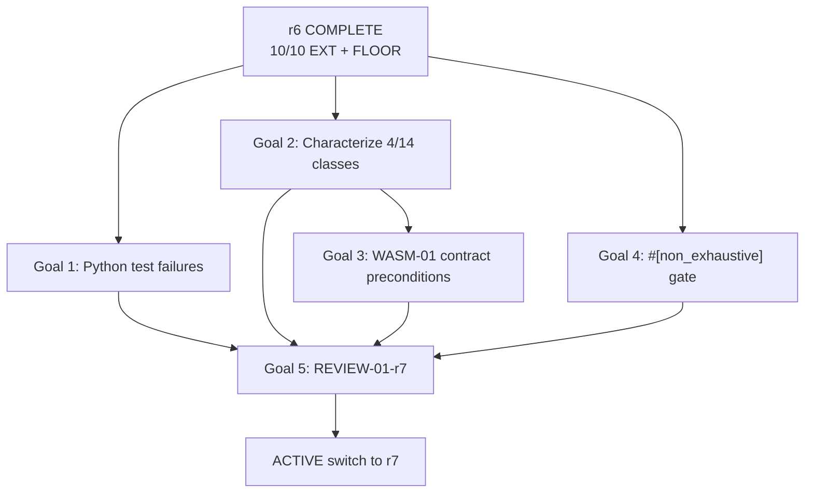

# Lab Colors — r7 (DRAFT)

**Evidence cutoff:** 2026-08-31T00:00:00Z (lab-colors main HEAD 39add39, FLOOR=1360, REVIEW-01-r6 10/10 PASS).

## 0. Delta from r6

r6 achieved full AUD-01 extension: 10/10 EXT nodes validated with RED→GREEN proof and sabotage controls. FLOOR baseline established at 1360 tests. All acceptance criteria satisfied per REVIEW-01-r6 validation report.

**What changes in r7:**

- Shift from audit coverage expansion to addressing identified gaps and preparing WASM-01 predecessor conditions
- Three pre-existing Python proof test failures require resolution or explicit classification as out-of-scope
- EXT-06 standalone claims extractor exists on ext09 branch but was delivered via bundling; assess whether standalone merge adds value
- Technical debt inventory: 1 TODO in crates/ (R-07 PR-C #[non_exhaustive] gate)
- MEM-01, CONF-01, PKG-01 remain blocked pending WASM-01 contract definition

**What carries forward unchanged:**

- INV-01 through INV-05 remain valid
- FLOOR baseline at 1360; CI gate enforces no regression
- GRAPH-01 merged and stable
- AUD-01 matrix format validated

## 1. Identified Gaps from r6 Validation

| Gap | Source | Severity | Impact |
|---|---|---|---|
| Pre-existing Python proof test failures (test_corpus_campaign_guard, test_workflow_inputs) | REVIEW-01-r6 Notes | Medium | Blocks clean CI signal; not caused by r6 but visible in baseline |
| EXT-06 standalone vs bundled delivery | REVIEW-01-r6 Note 2 | Low | Standalone version on ext09 branch has 9 tests; bundled version in main satisfies scope; no functional gap |
| EXT-01 delivered within scanner Stage 1 | REVIEW-01-r6 Note 1 | Low | Satisfies scope; standalone extraction not required |
| R-07 PR-C #[non_exhaustive] gate deferred | TODO in restorative_auto.rs:67 | Low | Action set finalization prerequisite; blocks type-level exhaustiveness guarantee |
| 4/14 artifact classes still uncovered | r6 §7 Unknowns | Medium | Must distinguish empty/nonexistent vs genuinely unextracted before WASM-01 |

## 2. Proposed r7 Goals

### Goal 1: Resolve or Classify Pre-existing Python Proof Test Failures

**Objective:** Achieve clean CI signal on main by either fixing test_corpus_campaign_guard and test_workflow_inputs or explicitly documenting them as out-of-scope for the Rust audit track with owner and timeline.

**Acceptance criteria:**
- Both tests pass on main OR each has a linked Issue with root cause analysis, classification (bug vs stale fixture vs deprecated path), owner assignment, and resolution timeline
- FLOOR baseline updated if test count changes
- No new test failures introduced

**Effort:** 3-5h (investigation + fix or documentation)
**Dependencies:** None

### Goal 2: Characterize Remaining 4/14 Uncovered Artifact Classes

**Objective:** For each of the 4 artifact classes not covered by EXT-01..EXT-09, determine whether the class is empty/nonexistent in this codebase or genuinely requires a new extractor. Produce a disposition row per class in the AUD-01 matrix.

**Acceptance criteria:**
- Each of the 4 uncovered classes has a matrix row with one of: FiniteManifest (with extractor reference), EmptyClass (with evidence of exhaustive search), NotApplicable (with rationale)
- Zero classes remain in ambiguous/unexamined state
- Disposition informs WASM-01 contract scope

**Effort:** 4-6h (codebase survey + matrix update)
**Dependencies:** None

### Goal 3: Define WASM-01 Contract Preconditions

**Objective:** Establish the concrete artifact classes, boundary types, and projection schema that WASM-01 will consume, based on completed AUD-01 coverage (10/14 minimum + 4 characterized). Reference #415 contract and produce a WASM-01 input specification document.

**Acceptance criteria:**
- WASM-01 input spec lists all artifact classes it consumes with source extractor reference
- Boundary types (WasmBoundary/NativeBoundary from EXT-07) mapped to WASM projection fields
- Spec reviewed against AUD-01 matrix for completeness
- Document placed in docs/ or plans/lab-colors/reference/

**Effort:** 5-8h (spec drafting + cross-reference validation)
**Dependencies:** Goal 2 (characterized classes inform scope)

### Goal 4: Address R-07 PR-C #[non_exhaustive] Gate

**Objective:** Finalize the action set in restorative_auto.rs and apply #[non_exhaustive] to close the type-level exhaustiveness guarantee, removing the TODO.

**Acceptance criteria:**
- #[non_exhaustive] applied to the relevant enum/struct
- All existing match arms verified complete against current action set
- Tests pass with the gate in place
- TODO comment removed

**Effort:** 1-2h
**Dependencies:** None

### Goal 5: Independent Review of r7 Plan

**Objective:** Pass plan-contract and future-axis review on this draft before ACTIVE switch.

**Acceptance criteria:**
- Both review axes return PASS verdict
- All findings resolved or explicitly accepted with rationale
- REVIEW-01-r7 document produced

**Effort:** 2-3h (review + finding resolution)
**Dependencies:** Goals 1-4 scoped (not necessarily complete; review validates plan structure)

## 3. DAG Dependencies

**Critical path:** Goal 2 → Goal 3 → Goal 5 (~11-17h serial)
**Parallel opportunity:** Goals 1, 2, and 4 are fully independent; can run concurrently.

## 4. Effort Summary

| Goal | Effort | Parallelizable | Blocks WASM-01 |
|---|---|---|---|
| 1: Python test failures | 3-5h | YES | NO |
| 2: Characterize 4/14 | 4-6h | YES | YES |
| 3: WASM-01 contract | 5-8h | NO (after G2) | YES |
| 4: #[non_exhaustive] | 1-2h | YES | NO |
| 5: Review | 2-3h | NO (after G1-G4) | YES |
| **Total** | **15-24h** | **~8-12h wall-clock** | |

## 5. Risk Assessment

| Risk | Likelihood | Impact | Mitigation |
|---|---|---|---|
| Python test failures require upstream dependency changes outside lab-colors scope | Medium | Medium | Classification as out-of-scope with linked Issue is valid exit; does not block Rust track |
| 4/14 characterization reveals need for additional extractors beyond r7 scope | Low | High | Disposition row captures this; triggers r8 planning rather than scope creep |
| WASM-01 contract spec premature without full 14/14 coverage | Medium | Medium | Spec explicitly notes which classes are consumed; uncovered classes documented as not-required or deferred |
| #[non_exhaustive] breaks downstream pattern matches | Low | Medium | Compile-time enforcement catches all sites; test suite validates |

## 6. Rollback Protocol

- **r7 plan before ACTIVE switch:** Close plan PR; ACTIVE.md remains on r6.
- **After ACTIVE switch, before implementation:** Create r8 reverting to r6 acceptance; atomic ACTIVE switch back.
- **Individual goal implementation:** Standard git revert per merged PR; FLOOR baseline updated if test count affected.
- **Full r7 rollback:** Revert in reverse merge order; verify FLOOR gate passes at each step.

## 7. Unknowns

- Root cause of Python proof test failures uninvestigated; may be stale fixtures, deprecated API paths, or genuine bugs.
- Whether any of the 4 uncovered classes contain artifacts that invalidate the 10/14 threshold for WASM-01 confidence.
- Whether WASM-01 contract can be fully specified without MEM-01 resource profile data.
- Whether EXT-06 standalone extractor on ext09 branch provides additional test coverage beyond bundled version.

## 8. Smells / CAPA

| Severity | Finding | CAPA |
|---|---|---|
| Medium | Python proof tests failing on main predates r6; not addressed during r6 execution | Goal 1 explicitly scopes resolution or classification; prevents accumulation of ignored failures |
| Low | EXT-06 delivery path (bundled vs standalone) creates ambiguity about canonical implementation | Goal 2 characterization includes EXT-06 scope verification; matrix row clarifies canonical source |
| Low | Single TODO in crates/ is low-priority but represents deferred type safety | Goal 4 closes it; prevents TODO accumulation |