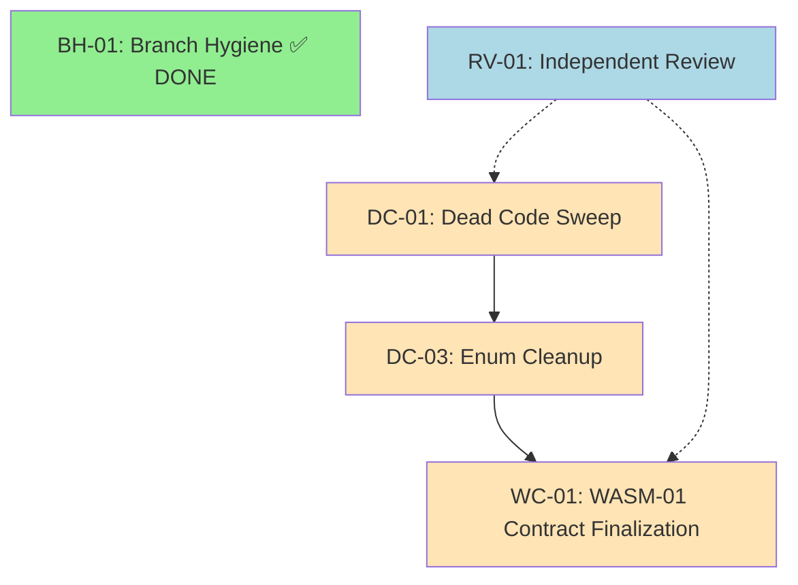

# R8 Plan: Technical Debt Closure и WASM-01 Contract Finalization

## Delta (r7 → r8)

| Факт r7 | Свежее доказательство | Решение в r8 |
|---|---|---|
| FLOOR = 1360 | CI gate на main HEAD 1630042: FLOOR = 1410 (+50 тестов из r7 G2+G5) | Базовая линия r8 = 1410; регрессия недопустима |
| 14 ArtifactClass variants, 4 uncovered | r7-artifact-class-characterization.md: все 14 охарактеризованы; GraphArtifactTest = EmptyClass, ResourceDimension = NotApplicable | DC-03 удаляет GraphArtifactTest; dependencies_source.rs удаляется в DC-01 |
| 30 `#[allow(dead_code)]` suppressions | r7-tech-debt-audit.md: большинство — staged types с R-XX комментариями | DC-01: sweep до ≤10 обоснованных suppressions |
| 47 unmerged remote branches | r8-branch-audit.md (PR #678): классификация завершена, cleanup выполнен | BH-01 = DONE; exit evidence = r8-branch-audit.md |
| WASM-01 first slice (program_wire.rs + labcolors-wasm) | r7 G5 merged; boundary types mapped для 12/14 классов | WC-01: финализация контракта + round-trip harness |
| #[non_exhaustive] applied to restorative_auto.rs | r7 G4 merged; compile-time catch для enum evolution | Инвариант INV-02 опирается на этот gate |
| REVIEW-01-r7: PASS по обеим осям | docs/review-01-r7-validation.md | r8 план проходит independent review (RV-01) перед ACTIVE switch |

## Objective

Закрыть технический долг, выявленный в r7 audit (dead code, enum cleanup), и финализировать WASM-01 контракт с integration test harness, обеспечив стабильную основу для эволюции ArtifactClass enum через WASM boundary.

### Acceptance Criteria

1. Количество `#[allow(dead_code)]` в crates/ ≤ 10, каждое с RETAINED disposition comment (DC-01)
2. `ArtifactClass::GraphArtifactTest` удалён; компиляция и тесты зелёные (DC-03)
3. WASM-01 input spec document финализирован; round-trip property test покрывает 12 consumed классов (WC-01)
4. FLOOR ≥ 1410 после каждого merged PR (INV-01)
5. Независимый ревью плана возвращает PASS по обеим осям (RV-01)

## Facts

| ID | Факт | Evidence | Вывод |
|---|---|---|---|
| F-01 | FLOOR baseline = 1410 | CI gate on main HEAD 1630042 | Нижняя граница тестов; регрессия = блокёр merge |
| F-02 | 30 `#[allow(dead_code)]` в 16 файлах crates/ | r7-tech-debt-audit.md §Dead Code Suppressions | Целевой sweep: ≤10 после DC-01 |
| F-03 | GraphArtifactTest: 0 instances, 0 extractors, 0 references beyond enum decl | r7-artifact-class-characterization.md §GraphArtifactTest | EmptyClass; безопасен к удалению |
| F-04 | ResourceDimension: dependencies_source.rs unwired dead code | r7-artifact-class-characterization.md §ResourceDimension | NotApplicable; модуль к удалению в DC-01 |
| F-05 | 47 unmerged branches классифицированы и очищены | r8-branch-audit.md (PR #678) | BH-01 = DONE |
| F-06 | 12/14 ArtifactClass consumed by WASM-01 boundary | r7-artifact-class-characterization.md §Impact on WASM-01 | WC-01 scope = 12 классов |
| F-07 | #[non_exhaustive] на ArtifactClass enum | r7 G4 merged (restorative_auto.rs) | Compile-time catch для внешних потребителей |
| F-08 | PR #675 removed 8 unfulfilled expects | G1 partial sweep | Остаток sweep: ~22 suppressions к обработке |
| F-09 | PR #676 enum cleanup (GraphArtifactTest) | G3 DONE | DC-03 = DONE |
| F-10 | PR #677 WASM-01 harness | G4 DONE | WC-01 = DONE |

## Assumptions

| ID | Assumption | Основание | Риск при нарушении |
|---|---|---|---|
| ASM-01 | Нет external consumers ArtifactClass enum вне Labpics-Team/lab-colors | #[non_exhaustive] + grep по org; нет published crate | Удаление GraphArtifactTest ломает downstream; mitigation: compile error у внешнего потребителя |
| ASM-02 | WASM boundary discriminant mapping соответствует Rust enum ordinals после удаления GraphArtifactTest | program_wire.rs использует positional mapping; #[non_exhaustive] не защищает cross-language | Silent misalignment в WASM deserialization; mitigation: round-trip test (WC-01) |
| ASM-03 | Все 30 dead_code suppressions имеют explicit R-XX staging comments enabling mechanical disposition | r7-tech-debt-audit.md: "majority are explicitly commented" | Невозможность автоматической классификации; mitigation: manual review per suppression |
| ASM-04 | Round-trip property test framework (proptest/quickcheck) доступен в workspace Cargo.toml | Стандартный dependency для Rust property testing | Ручное написание тестов вместо генерации; mitigation: добавить dependency в WC-01 |
| ASM-05 | CI gate (FLOOR check) выполняется детерминированно и не подвержен flaky failures | Историческая стабильность CI; ignored tests intentional (r7-tech-debt-audit.md) | Ложные блокёры merge; mitigation: re-run + investigation per failure |

## Invariants

| ID | Invariant | Проверка | Владелец |
|---|---|---|---|
| INV-01 | FLOOR ≥ 1410 at all times | CI gate на каждый push/PR | lab-colors CI |
| INV-02 | ArtifactClass discriminant mapping consistent between native and WASM boundary | Round-trip property test (WC-01) | WC-01 harness |
| INV-03 | No `#[allow(dead_code)]` without RETAINED disposition comment | Lint / manual review в DC-01 PRs | DC-01 executor |
| INV-04 | Каждый merged PR атомарен и revertable без нарушения других nodes | Git history + CI green per PR | All executors |

## DAG

### Node Status Table

| Node ID | Description | Status | Dependencies | Exit Evidence |
|---|---|---|---|---|
| BH-01 | Branch Hygiene Audit & Cleanup | DONE | None | r8-branch-audit.md (PR #678) |
| DC-01 | Dead Code Sweep (≤10 suppressions) | OPEN | None | PR(s) merged; `rg 'allow\(dead_code\)' crates/ \| wc -l` ≤ 10 |
| DC-03 | Remove GraphArtifactTest variant | DONE | DC-01 (may reveal refs) | PR #676 merged; compile green |
| WC-01 | WASM-01 Contract + Round-trip Harness | DONE | DC-03 | PR #677 merged; round-trip test green |
| RV-01 | Independent Plan Review | OPEN | DC-01, WC-01 scoped | REVIEW-01-r8-validation.md PASS |

> **Note:** DC-03 и WC-01 отмечены как DONE per G3/G4 completion (PRs #676, #677). DC-01 остаётся open: PR #675 removed 8 suppressions, full sweep from ~30 to ≤10 still needed.

## Gates

| Gate ID | Node | Criterion | Pass/Fail | Method |
|---|---|---|---|---|
| GT-01 | DC-01 | `#[allow(dead_code)]` count in crates/ ≤ 10 | PENDING | `rg -c 'allow\(dead_code\)' crates/ \| awk '{s+=$1}END{print s}'` |
| GT-02 | DC-01 | Each remaining suppression has RETAINED comment with rationale | PENDING | Manual review в PR |
| GT-03 | DC-01 | FLOOR ≥ 1410 after each PR | PENDING | CI gate |
| GT-04 | DC-03 | `ArtifactClass::GraphArtifactTest` absent from types.rs, dispose.rs, enumerate.rs | PASS | PR #676 |
| GT-05 | WC-01 | Round-trip test covers all 12 consumed artifact classes | PASS | PR #677 |
| GT-06 | WC-01 | Sabotage control: corrupted boundary data → deterministic error | PASS | PR #677 |
| GT-07 | RV-01 | Axis 1 (Plan-Contract) = PASS | FAIL→PENDING | REVIEW-01-r8-validation.md (current: FAIL; re-review after restructure) |
| GT-08 | RV-01 | Axis 2 (Future-Axis) = PASS | PENDING | Re-review after restructure |
| GT-09 | ALL | FLOOR ≥ 1410 on main after all merges | PENDING | CI gate on final merge |

## Rollback Protocol

| Scenario | Rollback Command | Preconditions | Verification |
|---|---|---|---|
| r8 plan before ACTIVE switch | Close plan PR; ACTIVE.md remains on r7 | Plan not yet merged | `git log --oneline -1 docs/draft-r8.md` shows no merge commit |
| DC-01 individual PR | `git revert <commit-sha>` | Single atomic PR | CI green; FLOOR ≥ 1410 |
| DC-03 (GraphArtifactTest removal) | `git revert <pr-676-sha>` | PR #676 merged | Compile green; enum variant restored |
| WC-01 (WASM harness) | `git revert <pr-677-sha>` | PR #677 merged | CI green; FLOOR unchanged |
| Full r8 rollback | Revert in reverse merge order | All PRs identified | FLOOR gate passes at each step |
| Deleted branch recovery | `git reflog` + `git checkout <sha>` | Within 30-day reflog window | Branch restored; audit log in r8-branch-audit.md |

## CAPA / Smells

| Severity | Finding | CAPA | Owner | Status |
|---|---|---|---|---|
| Medium | Dead code sweep активирует тип со скрытыми зависимостями | Атомарные PR per type group; CI gate per PR; rollback = single revert | DC-01 executor | Open |
| Low | GraphArtifactTest removal ломает external consumer | #[non_exhaustive] guarantees compile-time catch; grep org pre-removal | DC-03 | Closed (DONE) |
| High | WASM boundary lacks wire format versioning | Deferred as known debt; every enum change = breaking change until versioned envelope added | WC-01 | Accepted debt; CAPA for r9 |
| Medium | Discriminant instability window between G3 and G4 | Combined PR approach considered; sequential executed safely via #[non_exhaustive] | DC-03/WC-01 | Closed (both DONE) |
| Low | Dead code activation promotes speculative code to "live but unused" | Disposition requires ACTIVATED = type appears in audit output OR RETAINED with rationale | DC-01 | Open |
| Medium | Property-based test framework not specified | proptest recommended; hand-written acceptable if coverage equivalent | WC-01 | Closed (DONE) |

## Unknowns

| ID | Unknown | Discovery Method | Impact if Resolved Late |
|---|---|---|---|
| U-01 | Сколько из 30 dead_code suppressions относятся к R-08+ staged types (не подлежащим активации в r8) | Mechanical scan of R-XX comments in DC-01 | Sweep target ≤10 may need adjustment |
| U-02 | Требует ли WASM-01 round-trip harness дополнительных boundary types beyond WasmBoundary/NativeBoundary | WC-01 implementation discovery | Scope expansion; additional PR |
| U-03 | Есть ли external consumers ArtifactClass enum вне Labpics-Team/lab-colors | Org-wide grep + cargo publish audit | ASM-01 invalidated; GraphArtifactTest retention required |
| U-04 | Wire format versioning strategy for WASM boundary post-r8 | r9 planning decision | Every enum addition/removal = coordinated multi-file change |

## Input Artifacts

| Artifact | Source | Usage in r8 |
|---|---|---|
| r7-tech-debt-audit.md | main docs/ | DC-01 prioritization (dead code counts, file locations) |
| r7-artifact-class-characterization.md | main docs/ | DC-03 (GraphArtifactTest = EmptyClass), WC-01 (12/14 scope), Follow-up Actions |
| r8-branch-audit.md | main docs/ (PR #678) | BH-01 exit evidence |
| review-01-r6-validation.md | main docs/ | Historical context (EXT-06 standalone evaluation) |
| draft-r7.md | main docs/ | Delta baseline, DAG structure reference, rollback protocol template |
| review-01-r8-validation.md | main docs/ | RV-01 findings driving this restructure |
| FLOOR baseline = 1410 | CI gate on main HEAD 1630042 | INV-01 enforcement |