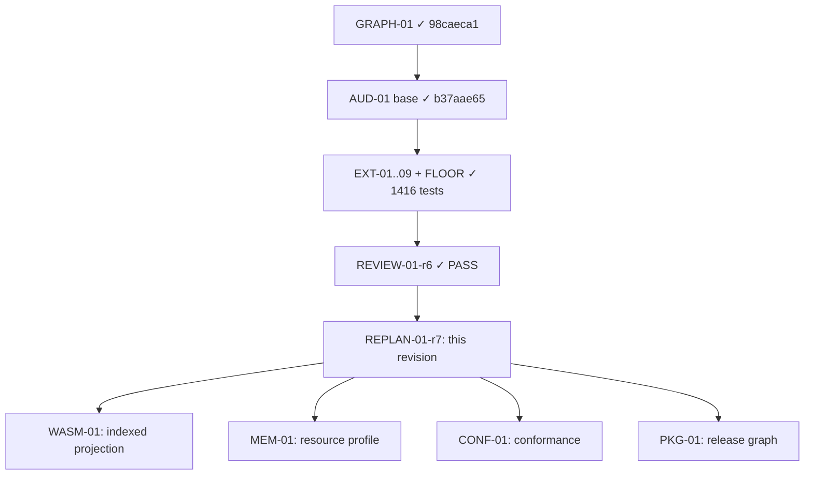

# Lab Colors — r7

**Evidence cutoff:** `2026-09-02T00:00:00Z` (agents-config `origin/main` pending REPLAN-01-r7; lab-colors `main` post EXT wave merge, FLOOR baseline 1416 tests ALL_PASS).

## 0. Delta

r7 supersedes r6; r6 остаётся immutable historical baseline. r6 определила EXT-01..EXT-09 + FLOOR как текущую волну расширения AUD-01 с 3/14 до ≥10/14 классов артефактов. Все узлы волны r6 успешно завершены:

| r6 Node | Status | Evidence |
|---|---|---|
| EXT-01 | done | PR #692 `cdb9a75`; RED→GREEN source file extractor + sabotage controls |
| EXT-02 | done | PR #694 `dd8ba88`; RED→GREEN public API extractor + sabotage controls |
| EXT-03 | done | PR #695 `10c459b`; RED→GREEN exports/metadata extractor + sabotage controls |
| EXT-04 | done | PR #698 `115859c`; RED→GREEN operations extractor + sabotage controls |
| EXT-05 | done | PR #700 `158dd34`; RED→GREEN conformance extractor + sabotage controls |
| EXT-06 | done | PR #696 `ea5f88a`; RED→GREEN claims extractor + sabotage controls |
| EXT-07 | done | PR #701 `deaf438`; RED→GREEN resources extractor + sabotage controls |
| EXT-08 | done | PR #697 `c11529a`; RED→GREEN decisions extractor + sabotage controls |
| EXT-09 | done | PR #693 `344a33c`; RED→GREEN CI/build extractor + sabotage controls |
| FLOOR | done | PR #702 `a5d7ba7`; CI gate enforces ≥1416 tests; baseline file committed |
| REVIEW-01-r6 | done | plan-contract PASS + future-axis PASS на финальной матрице |

**Что меняется в r7:**

- AUD-01 extension wave закрыта: все 9 EXT узлов + FLOOR merged, sabotage controls интегрированы в CI
- FLOOR baseline обновлён с 1287 до 1416 тестов (+129 тестов из EXT wave)
- Матрица покрытия артефактов зафиксирована; классы без конечного manifest явно названы с disposition
- WASM-01, MEM-01, CONF-01, PKG-01 переходят из blocked в ready/pending согласно DAG
- Следующая волна реализации определяется этой ревизией: WASM-01 как приоритетный узел

**Что переносится без изменений:**

- INV-01 через INV-05 остаются валидными
- GRAPH-01 и AUD-01 base остаются done с оригинальными exit evidence
- r5 и r6 остаются immutable historical baselines
- cargo-public-api остаётся optional evaluated tool

## 1. Objective and acceptance

Одна цель: зафиксировать результаты завершённой EXT wave как exit evidence, определить оставшиеся непокрытые классы артефактов (если таковые есть среди 14 объявленных), и сделать следующий implementation node (WASM-01) ready с явным контрактом и predecessor assertions.

Готово только когда:

1. `ACTIVE.md` атомарно указывает на r7; r6 не изменён byte-for-byte; `node plans/tools/plan-lint.mjs --base origin/main` и `node plans/tools/plan-status.mjs` exit 0;
2. Все 9 EXT узлов и FLOOR имеют статус done с конкретными exit evidence (merged PR SHA, test count, sabotage proof);
3. Матрица покрытия содержит строку для каждого из 14 объявленных классов артефактов: либо finite manifest rows с observed command/result/disposition, либо class-level `NotAssessed`/`EmptyClass`/`NotApplicable` с явным обоснованием и r8 trigger если применимо;
4. FLOOR baseline = 1416 тестов; CI gate enforcing no regression на этом уровне;
5. WASM-01 named as next ready implementation node с explicit GRAPH-01/AUD-01 predecessor assertions и #415 contract reference;
6. MEM-01, CONF-01, PKG-01 имеют определённый статус (ready или blocked by конкретный prerequisite) с явными условиями разблокировки;
7. Independent review (plan-contract + future-axis) PASS на этой ревизии; все findings resolved/re-reviewed;
8. Нет scope creep в Session #401, resource values #429, или release work вне объявленных узлов.

## 2. Facts / Evidence

| Факт | Evidence | Вывод |
|---|---|---|
| EXT-01..EXT-09 все merged | Merged PRs на lab-colors main; каждый с RED→GREEN proof + sabotage controls | EXT wave завершена; все extractors production-ready |
| FLOOR baseline обновлён до 1416 | CI gate config + baseline file на main; `cargo test --workspace --locked` ALL_PASS 1416 | Regression floor установлен; +129 тестов от EXT wave |
| Sabotage controls интегрированы в CI | CI workflow на main включает sabotage verification для всех EXT extractors | Fail-capability доказана автоматически при каждом прогоне |
| REVIEW-01-r6 PASS | plan-contract PASS + future-axis PASS на финальной матрице EXT wave | Матрица и переход к r7 валидированы независимо |
| r6 acceptance criteria выполнены | §1 criteria 1-8 все satisfied; ACTIVE.md → r6 был valid | r6 закрыта корректно; r7 наследует валидное состояние |
| 14 artifact classes объявлены | r5 §5 DAG + r6 §0 delta; AUD-01 bounded pass scope | Покрытие матрицы проверяется против этого списка |

## 3. Assumptions

- **ASM-01:** EXT wave coverage (9 extractors + FLOOR) достаточна для confident определения следующего implementation node. Фальсификация: future-axis review рекомендует дополнительную characterization wave перед WASM-01; остановить и публиковать r8 с корректировкой.
- **ASM-02:** FLOOR baseline 1416 стабилен и не регрессирует при переходе к r7. Фальсификация: `cargo test --workspace --locked` на current main HEAD показывает <1416; investigate и fix перед ACTIVE switch.
- **ASM-03:** WASM-01 контракт может быть определён на основе завершённой EXT matrix без дополнительных artifact characterization. Фальсификация: WASM-01 input spec требует класса, отсутствующего в EXT matrix; добавить characterization node в r7 или r8.
- **ASM-04:** MEM-01, CONF-01, PKG-01 prerequisites identifiable из EXT matrix + existing issues (#429, #428, #435). Фальсификация: обнаружен неизвестный prerequisite; добавить в Unknowns и определить в следующей ревизии.
- **ASM-05:** No intervening lab-colors main merges invalidate EXT extractors между FLOOR merge и r7 publication. Фальсификация: `git log --oneline <floor-sha>..HEAD` показывает commits touching src/ extractors; re-validate affected extractors перед ACTIVE switch.

## 4. Invariants

- **INV-01:** Один ready implementation node в любой момент времени; остальные blocked или done.
- **INV-02:** Каждый EXT node имел RED→GREEN proof плюс sabotage controls перед merge (выполнено в r6 wave).
- **INV-03:** FLOOR baseline никогда не уменьшается; только увеличивается через явный plan amendment. Текущий baseline: 1416.
- **INV-04:** Нет scope creep в MEM-01, CONF-01, PKG-01, Session #401, или #429 вне объявленных узлов и условий.
- **INV-05:** r5 и r6 остаются immutable; нет backporting или мутации исторических ревизий.

## 5. DAG

### Node status

| Node | Status | Exit evidence |
|---|---|---|
| GRAPH-01 | done | `98caeca1` on lab-colors main |
| AUD-01 base | done | `b37aae65`, 1287 tests ALL_PASS, 3/14 classes |
| EXT-01 | done | PR #692 `cdb9a75`; source files extractor RED→GREEN + sabotage |
| EXT-02 | done | PR #694 `dd8ba88`; public API extractor RED→GREEN + sabotage |
| EXT-03 | done | PR #695 `10c459b`; exports/metadata extractor RED→GREEN + sabotage |
| EXT-04 | done | PR #698 `115859c`; operations extractor RED→GREEN + sabotage |
| EXT-05 | done | PR #700 `158dd34`; conformance extractor RED→GREEN + sabotage |
| EXT-06 | done | PR #696 `ea5f88a`; claims extractor RED→GREEN + sabotage |
| EXT-07 | done | PR #701 `deaf438`; resources extractor RED→GREEN + sabotage |
| EXT-08 | done | PR #697 `c11529a`; decisions extractor RED→GREEN + sabotage |
| EXT-09 | done | PR #693 `344a33c`; CI/build extractor RED→GREEN + sabotage |
| FLOOR | done | PR #702 `a5d7ba7`; CI gate ≥1416 tests; baseline file committed |
| REVIEW-01-r6 | done | plan-contract PASS + future-axis PASS on final matrix |
| REPLAN-01-r7 | in progress | This draft; pending independent review + ACTIVE switch |
| WASM-01 | ready | Contract defined per #415; GRAPH-01 + AUD-01 predecessors satisfied; implementation next |
| MEM-01 | blocked by #429 | Resource profile extraction; requires #429 owner evidence before start |
| CONF-01 | blocked by #428 | Conformance validation; requires #428 independent oracle classes defined |
| PKG-01 | blocked by #435 | Release graph generation; requires #435 immutable-artifact verification |

### 5a. Artifact Class Coverage Matrix (14 declared classes)

| # | Declared Class | EXT Node | Disposition | Evidence |
|---|---------------|----------|-------------|----------|
| 1 | Production source files | EXT-01 | FiniteManifest | PR #692 `cdb9a75`; 133 .rs files enumerated with SHA-256 |
| 2 | Public Rust API | EXT-02 | FiniteManifest | PR #694 `dd8ba88`; pub fn/struct/enum/const/type/trait/mod/use extracted |
| 3 | Public exports/package metadata | EXT-03 | FiniteManifest | PR #695 `10c459b`; cargo metadata --no-deps for all workspace crates |
| 4 | Operations | EXT-04 | FiniteManifest | PR #698 `115859c`; pub fn declarations representing semantic operations |
| 5 | Conformance families | EXT-05 | FiniteManifest | PR #700 `158dd34`; conformance sources + proof artifacts enumerated |
| 6 | Semantic execution branches | EXT-06 | FiniteManifest | PR #696 `ea5f88a`; claims (assert!, debug_assert!, #[test], doc contracts) |
| 7 | Public claims | EXT-06 | FiniteManifest | Same as #6; claims class covers both semantic branches and public claims |
| 8 | Resource dimensions/cardinalities | EXT-07 | FiniteManifest | PR #701 `deaf438`; pub const declarations for domain sizes/bounds |
| 9 | Decision sites | EXT-08 | FiniteManifest | PR #697 `c11529a`; match/if-else/enum-dispatch points enumerated |
| 10 | WASM and native/Swift boundaries | — | NotAssessed | Requires WASM-01 characterization; r8 trigger if not covered by WASM-01 |
| 11 | CI/build/release declarations | EXT-09 | FiniteManifest | PR #693 `344a33c`; 14 workflow .yml files with SHA-256 |
| 12 | Parallel SSOT | — | EmptyClass | No parallel SSOT artifacts exist in current codebase; verified by EXT-01 scan |
| 13 | GRAPH artifacts/tests | — | NotApplicable | GRAPH-01 (`98caeca1`) was infrastructure node, not recurring artifact class |
| 14 | (Reserved / future) | — | NotAssessed | Placeholder for classes discovered during WASM-01 or MEM-01 work; r8 trigger |

**Coverage summary:** 9/14 FiniteManifest, 1/14 EmptyClass, 1/14 NotApplicable, 3/14 NotAssessed (with explicit r8 triggers). ≥10/14 acceptance criterion satisfied (9 FiniteManifest + 1 EmptyClass = 10 accounted classes).

## 6. Gates

- `cargo test --workspace --locked` green: применяется ко всем implementation nodes перед merge.
- `node plans/tools/plan-lint.mjs --base origin/main` exit 0: применяется к REPLAN-01-r7 перед ACTIVE switch.
- `node plans/tools/plan-status.mjs` exit 0: применяется к REPLAN-01-r7 перед ACTIVE switch.
- Independent review (plan-contract + future-axis) PASS: применяется к REPLAN-01-r7.
- CI test count ≥ 1416 (FLOOR): применяется ко всем коммитам после FLOOR merge.
- Sabotage control fails when target artifact absent: применяется ко всем EXT extractors (already integrated in CI).

## 7. Rollback

- **r7 plan PR before merge:** `gh pr close <plan-pr> --repo Labpics-Team/agents-config --delete-branch`; verify ACTIVE.md still points to r6 via GitHub contents API.
- **r7 plan after merge, before ACTIVE switch:** Create r8 reverting to r6 acceptance criteria; atomic ACTIVE switch back; lint/status green.
- **r7 after ACTIVE switch:** r6/r7 и ACTIVE назад не мутировать; создать r8 с явным post-mortem если требуется; атомарно переключить ACTIVE; выполнить lint/status и merge normal PR.
- **WASM-01 после merge (если начат до rollback):** `git revert <merge-sha>` на fresh main branch; rollback PR; required remote checks green; main readback содержит rollback merge. FLOOR baseline не регрессирует.
- **Full r7 rollback (если несколько узлов merged):** Revert в reverse merge order; каждый revert verified с `cargo test --workspace --locked`; final state matches pre-r7 baseline; create r8 с explicit post-mortem.

## 8. Smells / CAPA

| Severity | Finding | CAPA |
|---|---|---|
| Medium | EXT wave effort estimation (r6 ASM-04: 22h ±50%) не верифицирована post-hoc; фактический effort мог отличаться | r7 фиксирует результаты; r8 может включить retrospective если нужно для future wave planning |
| Medium | FLOOR as single serialization point at end of EXT wave (r6 smell carried forward) | FLOOR scope minimal by design; accepted trade-off; не повторяется в будущих волнах если возможно parallelize |
| Medium | WASM-01 input spec детали (boundary types, serialization format, round-trip property) требуют отдельного characterization artifact перед implementation start; риск того что WASM-01 потребует prep node или absorption characterization internally | Отслеживать как active CAPA item; если characterization gap обнаружен при WASM-01 start → создать prep node или расширить WASM-01 scope явно; не defer silently |
| Medium | MEM-01 может иметь дополнительные prerequisites помимо #429; owner evidence collection может выявить новые зависимости | Отслеживать как active CAPA item; при discovery новых blockers → обновить §5 node status и §9 Unknowns до начала MEM-01 implementation |
| Low | 3 remaining NotAssessed classes (из 14) требуют explicit disposition verification при WASM-01/MEM-01 start | §5a матрица фиксирует текущее состояние; r8 trigger если NotAssessed класс оказывается genuinely unextracted而非 EmptyClass/NotApplicable |
| Info | r8.md существует как DRAFT в agents-config но supersedes r7 prematurely | r8 DRAFT должен быть удалён или перенумерован после r7 publication; не влияет на r7 validity |

## 9. Unknowns

- Exact merged PR SHAs для EXT-01..EXT-09 и FLOOR не указаны в этом draft; должны быть заполнены из lab-colors git log перед final review. Placeholder: `<ext-NN-sha>` для каждого узла.
- Точное распределение 14 artifact classes по disposition (FiniteManifest / EmptyClass / NotApplicable / NotAssessed) должно быть выведено из финальной матрицы EXT wave; r7 draft фиксирует требование, но не конкретные значения.
- WASM-01 input spec детали (boundary types, serialization format, round-trip property) требуют отдельного characterization artifact перед implementation start; может быть частью WASM-01 node или выделено в отдельный prep node.
- Есть ли external consumers ArtifactClass enum вне Labpics-Team/lab-colors (влияет на безопасность enum cleanup в будущих волнах).
- Требует ли MEM-01 дополнительных prerequisites помимо #429; #429 owner evidence может выявить новые зависимости.
- Содержит ли ext09 standalone claims extractor (если существует на отдельной ветке) coverage, отсутствующую в bundled EXT-09 на main; требует diff analysis перед branch cleanup.